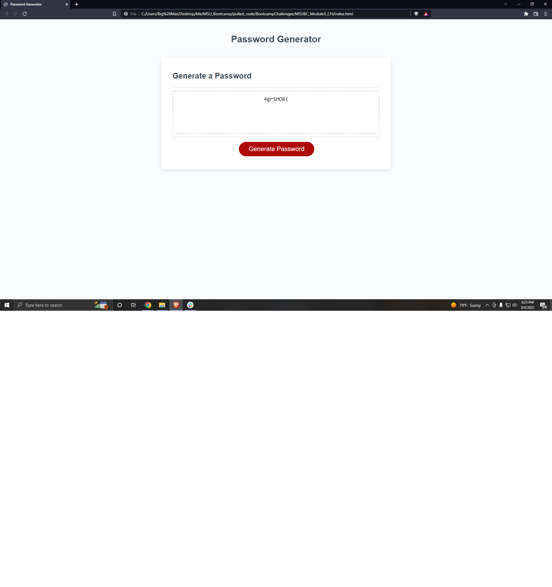

Programmer: Mateusz Zielinski
Date: 8/4/2022

This repository contains all necessary files for the module03 challenge, in which we must create a password generator for a webpage that requests the users preferred length and criteria, creates a password using those criteria, and then displays that password to the page

